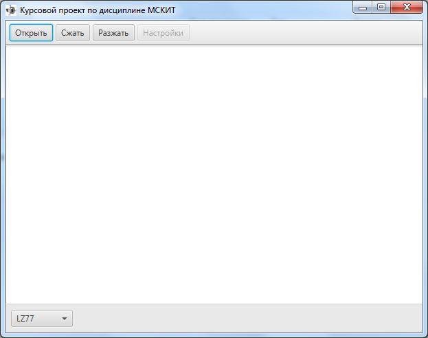
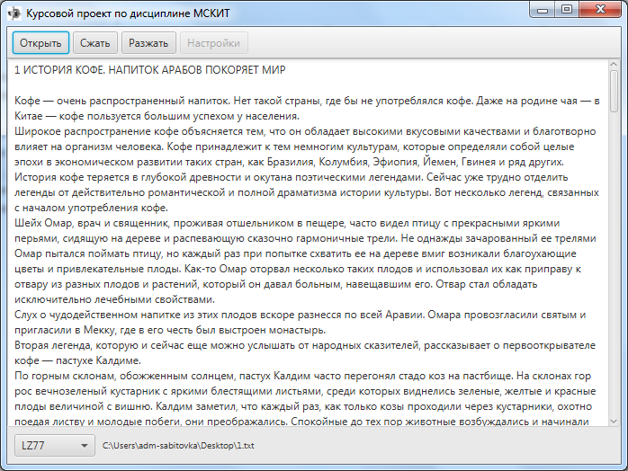
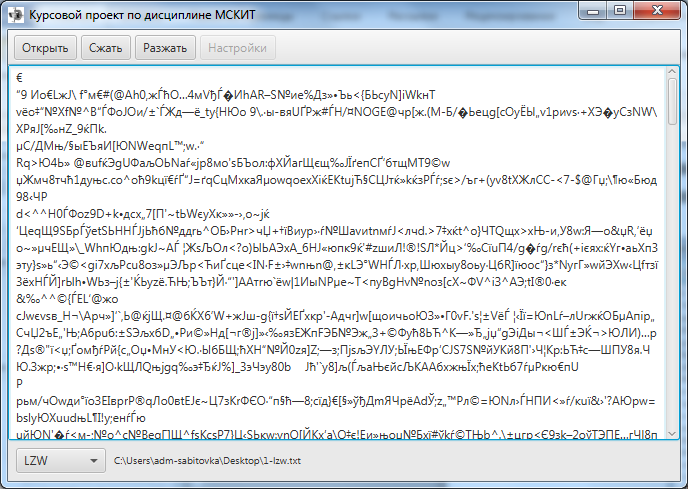

<a name="readme-top"></a>

<!-- PROJECT LOGO -->
<br />
<div align="center">
  <a href="https://donntu.ru/" target="_blank">
    
  </a>
  <h3 align="center">LZCompression*</h3>
  <p align="center">
    Сжатие текстовых данных методами семейства LZ
    <br>
  </p>
  <p align="right">
    <small><i>*Проект выполнен в рамках курса дисциплины «Методы и средства компьютерных информационных технологий» в ходе обучения в
    <br>
    <strong>Донецком Национальном техническом университете</strong></i></small>
  </p>
</div>

## О проекте



Данный проект представляет собой курсовую работу на тему «Сжатие текстовых данных методами семейства LZ». Выполнена в ходе обучения в бакалавриате в ФГБОУ ВО ДонНТУ в 2022 году. В работе рассматриваются методы сжатия текстовой информации семейства Лемпела-Зива, приводятся примеры работы алгоритмов и результаты сжатия в сравнении друг с другом.

В проекте реализованы следующие типы сжатий информации:
* LZ77
* LZSS
* LZ78
* LZW

Характерной особенностью проекта является то, что информация сжимается "налету", а не полностью записывается в оперативную память, тем самым достигается возможность сжимать файлы любого размера. 
В проекте разработан класс, который позволяет работать с потоком, забирая оттуда n-ное количество бит. 

Реализация проекта выполнялась с использованием языка программирования Java и библиотекой для создания пользовательских интерфейсов JavaFX.

<p align="right">(<a href="#readme-top">наверх</a>)</p>

## Приступая к работе

Чтобы запустить локальную копию системы, выполните следующие простые действия.

### Компоненты                                                                

Убедитесь, что у вас установлены следующие компоненты:
* Oracle Java 8
* Apache Maven 3.9.8

### Установка

1. Клонируйте репозиторий
  ```sh
    git clone https://gitflic.ru/project/sabitovka/lzcompression.git && cd client
  ```
2. Скомпилируйте проект с помощью Maven
  ```sh
    mvn clean compile
  ```
3. Запустите систему
  ```sh
    mvn javafx:run
  ```

<p align="right">(<a href="#readme-top">наверх</a>)</p>

## Использование

Перед сжатием или разжатием информации, необходимо открыть файл с текстом. Кнопка "Открыть" показывает диалоговое окно выбора файла. После чего внизу экрана выбрать из выпадающего списка метод сжатия или разжатия. После выполнить необходимое действие.



**Важно убедиться, чтобы разжатие использовало тот же метод, каким файл сжали!**



После выполнения действия, необходимо выбрать файл для сохранения.

### Результаты

Тестирование программы будем производить на файле с текстом длиной 16 042 символа (байта). Для оценки степени сжатия алгоритма сожмем этот файл каждым методом, сравним полученные результаты, затем декодируем текст обратно

| Метод | Байт после сжатия | Результат сжатия          |
|-------|-------------------|---------------------------|
| LZ77  | 16 978            | Увеличилось на 936 байт   |
| LZSS  | 15 699            | Уменьшилось на 343 байта  |
| LZ78  | 15 836            | Уменьшилось на 206 байтов |
| LZW   | 11 824            | Уменьшилось на 4 218 байт |


<p align="right">(<a href="#readme-top">наверх</a>)</p>

## Вклад

Вклады - это то, что делает сообщество разработчиков с открытым исходным кодом замечательным местом для обучения, вдохновения и творчества. Я **высоко оценю любой ваш вклад**.
Если у вас есть предложения по улучшению системы, сделайте Форк и создайте Запрос на слияние. Также вы можете создать issue с тегом "enhancement"
1. Сделайте Форк проекта
2. Создайте новую ветку фичи (`git checkout -b feature/your-feature`)
3. Закоммитте изменения (`git commit -m 'Добавлена новая фича'`)
4. Запуште изменения (`git push origin feature/your-feature`)
5. Создайте запрос на слияние

<p align="right">(<a href="#readme-top">наверх</a>)</p>

## Лицензия

Распространяется по лицензии MIT. Дополнительную информацию смотрите в файле "LICENSE.txt`.

<p align="right">(<a href="#readme-top">наверх</a>)</p>

## Контакты

Карим Сабитов
* [VK](https://vk.com/id87074050)
* [karim.sab@yandex.ru](mailto://karim.sab@yandex.ru)

Другие ссылки на проект:
* GitHub - [https://github.com/sabitovka/lzcompression](https://github.com/sabitovka/lzcompression)
* GitFlic - [https://gitflic.ru/project/sabitovka/lzcompression](https://gitflic.ru/project/sabitovka/lzcompression)

<p align="right">(<a href="#readme-top">наверх</a>)</p>
